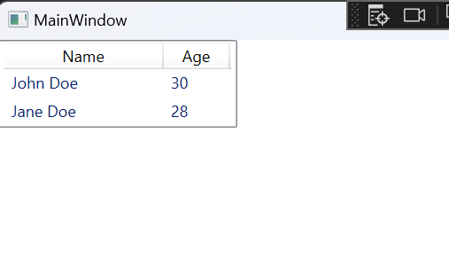
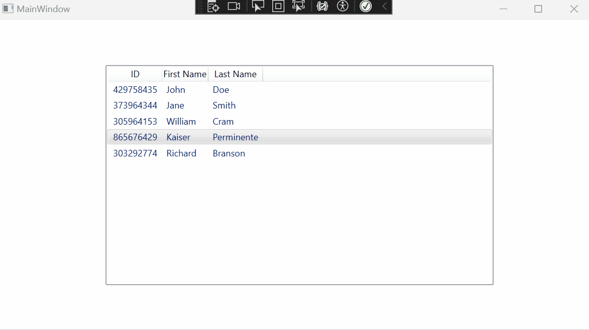

# GA_ListView

## What is a ListView

The ListView control in WPF applications lets you display an organized, tabluar list of information in columns with headers.

The ListView works by `binding` data to our list view, such as a List or ObservableCollection. We then Add individual columns to our table by `binding properties` to the columns.



### XAML Code:
```xml
    <ListView Name="ListViewExample">
        <ListView.View>
            <GridView>
                <GridViewColumn Header="Name" Width="120" DisplayMemberBinding="{Binding Name}" />
                <GridViewColumn Header="Age" Width="50" DisplayMemberBinding="{Binding Age}" />
            </GridView>
        </ListView.View>
    </ListView>
```
### C# Code-behind:

```csharp
public partial class MainWindow : Window
{
    public MainWindow()
    {
        InitializeComponent();

        List<Person> people = new List<Person>
        {
            new Person { Name = "John Doe", Age = 30 },
            new Person { Name = "Jane Doe", Age = 28 },
            // Add more people here
        };

        ListViewExample.ItemsSource = people;
    }
}

public class Person
{
    public string Name { get; set; }
    public int Age { get; set; }
}
```

### Important Properties

- `x:Name`: is used reference your ListView in your CSharp
- `ItemsSource`: Is used to connect a list to our ListView
```xml
    <ListView
        x:Name="listViewName"> </ListView>
```

Inside of our ListView 

- `GridViewColumn`: The grid view column tag lets us add additional columns
- `Header="Header Tag"`: The header will display at the top of the column to identify what the data is
-  `DisplayMemberBinding="{Binding ClassProperty}"`: Defines what data you want to display inside our list

```xaml
<GridViewColumn 
    Header="Header Title"
    DisplayMemberBinding="{Binding ClassProperty}" />
```

---

## Assignment

`Designer`

1. Add a ListView item to your application
    - Give it a name
    - `x:Name="lvDisplayList"`  

`Code`

2. Create a new class `Student`
    - Fields and Properties
        - `string _idNumber`
        - `string _firstName`
        - `string _lastName`
    - Constructor
        - Takes `firstName` and `lastName` as parameters
        - Generate a random 9 digit number for the id number  
        `Random rand = new Random();`  
        `_idNumber = rand.Next(100000000,1000000000).ToString();`
    - No Methods
3. Create a global list of Student in `MainWindow.xaml.cs`.
    - Populate with 5 students.
4. Attach the list to your `lvDisplayList.ItemsSource`.

`Designer`

5. In your `MainWindow.xaml` page, create `<GridViewColumns />` for each of your Students properties

6. Double click your `lvDisplayList`. This will create a click event.

`Code`

7. In your `MainWindow()` method, add the line `lvDisplayList.SelectedIndex = 0`. This will auto select the first item on load.

8. In your list view click event, create the code so that when the user clicks on a name in our list view, a message box appears showing their full name.



## How to setup

1. 